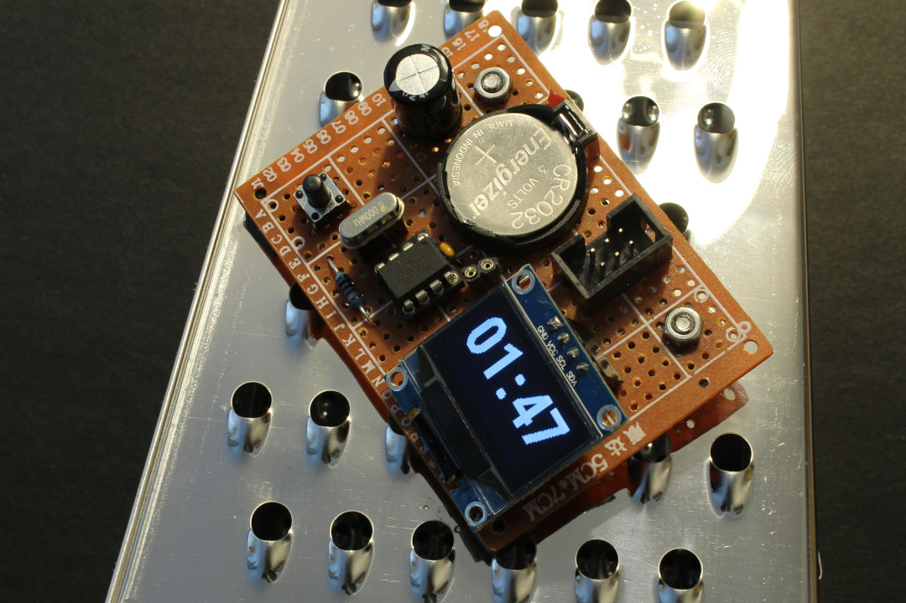
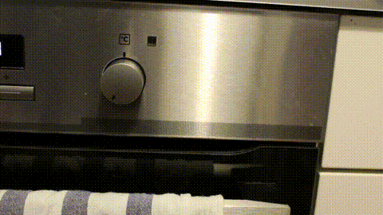

# cook'oo clock - The Smack-'n-Go Reverse Kitchen Timer



Regular kitchen clocks are alright and do their job most of the time - but sometimes you just wish it worked the complete opposite way. So instead of counting down from a time you need to specify upfront, it would just count the elapsed time, and you worry about how long it should count when the time for that has come.

Sure, every phone usually has a stopwatch functionality, but do you have your phone in reach? Are your hands clean enough that you can actually start the stopwatch? It's a small obstacle, but if you have some heated cooking session going on, it's just no ideal solution.

The solution: magnets!  
And conductive surfaces!

There's countless conductive surfaces in your average kitchen: knives, cutlery, pots and pans, cheese graters, fancy olive oil containers, appliances. Not the fridge though, or really anything coated which may be magnetic, but not conductive. Still, plenty of options.

Taking such a conductive surface and a pair of magnets can form a switch - and does so in this magnificent kitchen gadget. Just smack the cook'oo clock on any of those surfaces, closing the circuit, and the clock is ready to go! All you need is a free hand for a brief moment.

<p align="center">

</p>

## Links

[Hackaday.io project page](https://hackaday.io/project/173711-cookoo-clock).

To see the smackin' in action, [there's a video on YouTube](https://www.youtube.com/watch?v=aM7hTmq7Qc4), which is taken from [this longer version video](https://www.youtube.com/watch?v=3XJ_F8kyCZM), which also contains basically the same information as above and, well, shows the clock itself around.

## What's In It?
The cook'oo clock is powered by a CR2032 coin cell and uses an ATtiny85 with a 0.96" OLED. A hardware timer triggers every second and updates the display content, then the uC goes to sleep for the remainder of that second. An additional button will reset the controller and the display, and show the last counted time - just in case it's worthy to keep track of it.

Some rudimentary tests have shown that the clock is still operational at 1.3V, although the OLED is definitely at its limit here. Any less and the display gets dark. Still, I could utilize coin cells here that other devices have given up on.

## Setup

cook'oo clock uses two external libraries: [Tiny4kOLED](https://github.com/datacute/Tiny4kOLED) to handle the SSD1306 OLED, and [tiny-i2c](https://github.com/technoblogy/tiny-i2c) to handle I2C via the ATtiny85's USI (used by the Tiny4kOLED library itself). Both are integrated as git submodules, so make sure you clone this repo accrodingly:

```
$ git clone --recurse-submodules https://github.com/sgreg/cookoo-clock.git
```

In case you were overly eager with the cloning and forgot the `--recurse-submodules` option, no worries, you can do it afterwards as well:

```
$ cd cookoo-clock/
[cookoo-clock/]$ git submodule init
[cookoo-clock/]$ git submodule update
```

To make it even simpler, just run `make init` from
```
[cookoo-clock/]$ cd firmware/
[cookoo-clock/firmware/]$ make init
```

### Using ZIP file instead of Git

Note that when downloading the repository as .zip file, the git submodules' code won't be included in the archive, and compiling without them will fail. As the extracted .zip file is not set up as actual git repository, the build system won't be able to fix this via `make init`, and the libraries need to be downloaded manually.

To add the libraries' code to the cook'oo clock repository, follow their link in the [`firmware/libraries/`](firmware/libraries) directory, download the project's .zip file as well, and copy the content in `firmware/libraries/`.

Keep in mind that these are links to the repository at a specific commit, and downloading the .zip file will add the commit hash to the directory name, so make sure you rename the directory accordingly / replace the existing (empty) one with it.

Assuming all .zip files are downloaded in `/tmp/`, here's how that could look like. First, extract them all:
```
[/tmp/]$ unzip cookoo-clock-master.zip
[/tmp/]$ unzip /tmp/Tiny4kOLED-da4a2006816b5208bc94e0ab7f35bfb5fe0e5b8d.zip
[/tmp/]$ unzip /tmp/tiny-i2c-1029f6fca7c297eb887b601e3b0e352f71e60d1c.zip
```
Rename directory so it matches the rest of this README (.zip file contains also branch names) and enter the `libraries` directory:
```
[/tmp/]$ mv cookoo-clock-master cookoo-clock
[/tmp/]$ cd cookoo-clock/firmware/libraries/
```
Remove existing (empty) directories and move the downloaded ones in their place:
```
[/tmp/cookoo-clock/firmware/libraries/]$ rmdir Tiny4kOLED tiny-i2c
[/tmp/cookoo-clock/firmware/libraries/]$ mv /tmp/Tiny4kOLED-da4a2006816b5208bc94e0ab7f35bfb5fe0e5b8d Tiny4kOLED
[/tmp/cookoo-clock/firmware/libraries/]$ mv /tmp/tiny-i2c-1029f6fca7c297eb887b601e3b0e352f71e60d1c tiny-i2c
```

Now everything should be set up here as well, and the code can be compiled.


## Build

You'll need the AVR GCC toolchain to build the firmware, which can be installed in Ubuntu / Debian via

```
$ sudo apt install gcc-avr avr-libc avr-binutils avrdude make
```

in Fedora etc. via

```
$ sudo dnf install avr-gcc avr-libc avr-binutils avrdude make
```

and in any other distribution probably with very much the same package names.

Once installed, just run `make` in the `firmware/` directory:

```
[cookoo-clock/]$ cd firmware/
[cookoo-clock/firmware/]$ make
```

### Pre-built ELF and HEX files

Alternatively, there is a pre-built `clock.elf` binary and `clock.hex` file [available in the releases](https://github.com/sgreg/cookoo-clock/releases) that can be flashed straight away, and won't require to set up the AVR GCC tool chain and build it all from scratch.

If you only want to flash the firmware, the `clock.hex` file is all you'll need, the `clock.elf` file is just there for completeness.

## Flash And Burn

The `Makefile` is written for USBasp programmers, but adjusting for any other programmer won't be a big deal. Check for the `AVRDUDE_FLAGS` variable and change the `-c` parameter accordingly - and depending on the programmer itself, add other required parameters (like `-P`) along the way.

### Using Arduino As Programmer
If you don't have a programmer at all, but a spare Arduino, you should be able to use that as programmer. There's some [general information on the Arduino website](https://www.arduino.cc/en/Tutorial/ArduinoISP) about that, but what worked for me was to upload the built-in ["Arduino ISP" example sketch](https://www.arduino.cc/en/Tutorial/BuiltInExamples#arduinoisp) and connect the ISP connector to the Arduino's VCC, GND, MISO, MOSI, SCK pins, and the ISP's reset pin to digital out 10 (or adjust the example accordingly). After adjusting the `Makefile` to

```
AVRDUDE_FLAGS = -p $(TARGET_CONTROLLER) -c arduino -P /dev/ttyACM0
```
things worked just as with any programmer. Note that the USB port might vary in your setup, depending on your operating system and Arduino board (in my case, Pro Micro clone on Linux).

### Get Flashing

To verify the programmer and target microcontroller is set up properly and recognized, run `make check-programmer` from within the `firmware` directory, and check for `SUCCESS` (or `FAILURE`) output at the end.

```
[cookoo-clock/]$ cd firmware/
[cookoo-clock/firmware/]$ make check-programmer

...
SUCCESS
[cookoo-clock/firmware/]$ 
```

If all is well, proceed to flash the firmware from within the `firmware/` directory:

```
[cookoo-clock/firmware/]$  make program
```

**Note:** if you downloaded the [pre-built files from the release](#pre-built-elf-and-hex-files), make sure you copy the `clock.hex` file in the `firmware/` directory before running `make program` (or adjust the Makefile).

### Don't Forget The Fuses

If you flash the firmware for the very first time, make sure you also burn the ATtiny85's fuses so the clock source is set up properly:

```
[cookoo-clock/firmware/]$  make fuses
```

### No Make?

In case you don't have `make`, you can do all this directly with `avrdude` instead.
Instead of `make program`, run:
```
$ avrdude -p attiny85 -c usbasp -U flash:w:clock.hex
```
And instead of `make fuses`, run:
```
avrdude -p attiny85 -c usbasp -U lfuse:w:0x7d:m -U hfuse:w:0xdf:m -U efuse:w:0xff:m
```

Check some [fuse calculator](https://www.engbedded.com/fusecalc/) to get an idea what's happening with those fuse settings if you're curious.

Again, if you use a different programmer than USBasp, adjust the `-c` command line parameter again the same way as you would with the `AVRDUDE_FLAGS` mentioned above (and if needed, add the `-P <port>` along the way).

And if you don't have `avrdude` ..then you're unfortunately on your own.

## Using The Clock

There's really not much to do here. Once the clock's magnets get short circuited (in a good way) on a conductive surface, the clock starts up and gets the counting going. There is only one button as user interface, which restarts the clock and displays the last counted time on the bottom. That's all there is, really.

